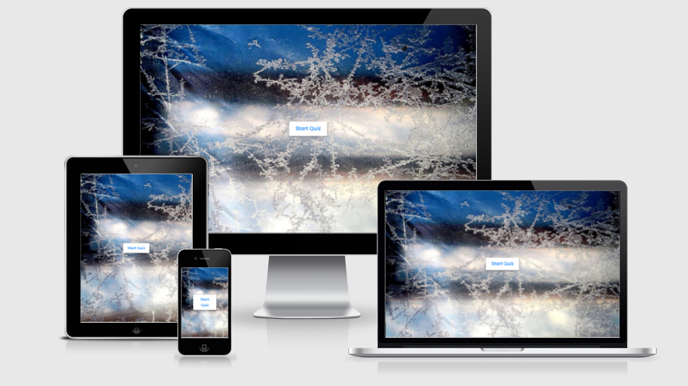
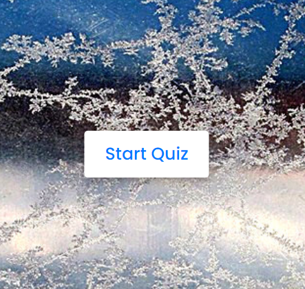
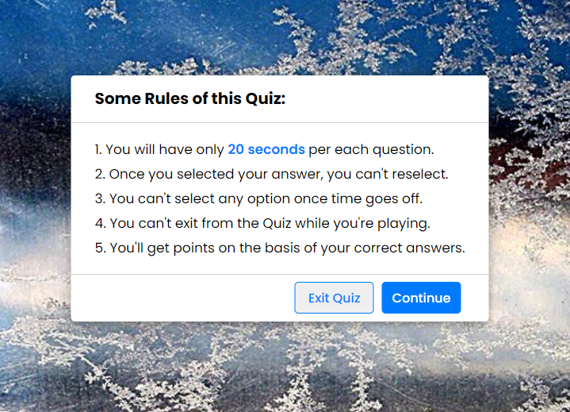
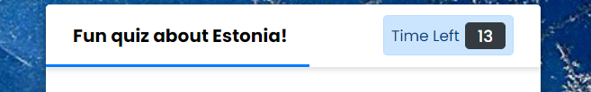
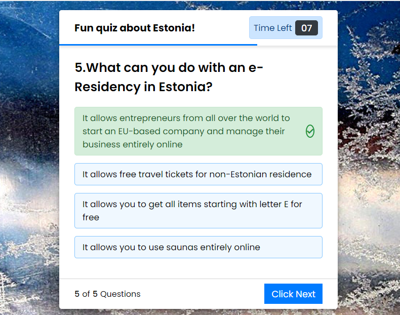
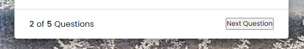
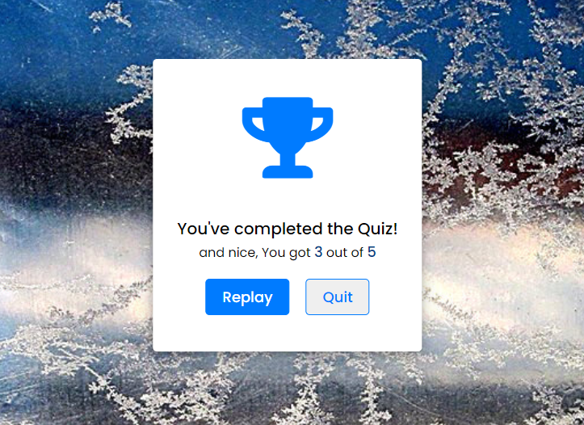
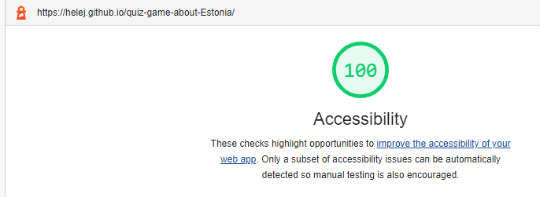
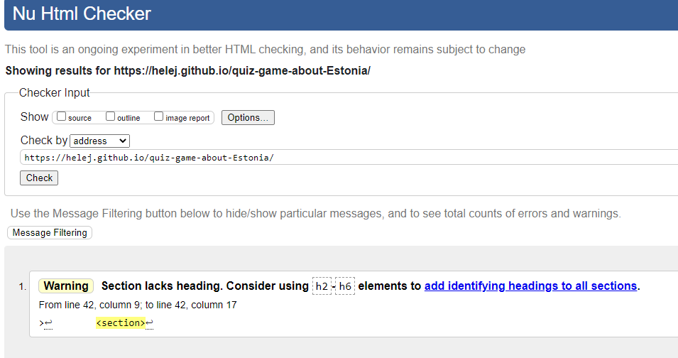
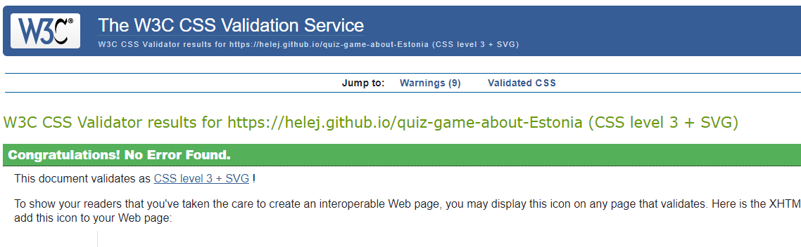

# QUIZ  GAME  about  ESTONIA

## Welcome to my very first game!

This website was built as part of the learning material for Code Institute's Fullstack Web Developer program (5P) Portfolio Project Two. It will be a quiz website aimed at the people who would be interested about Estonia or people, who never even heard about Estonia and interested about short game.

You can check out the website [here!](https://helej.github.io/quiz-game-about-Estonia)

## Project Description
This site was created in order to get familiar with common development tools like Gitpod, Git & GitHub, and how to use them to write and manage code.The website content will be created with HTML, the website will be styled with the use of CSS, and it's functionality will come from the implementation of JavaScript.The project itself will display a breakdown of the different technologies used in each of the different sections of the program.

## Technology
This project was written in HTML, CSS & JavaScript using GitHub.

# Table of contents
1. Introduction
2. Design  
3. Features
4. Future Features
5. Testing
6. Deployment
7. Credits

##  Introduction

### Colour scheme

## Features

*Start page consists background image and Start button

*Info box page consists Title, List of rules, and two buttons "Exit Quiz" and "Continue"

* Quiz boxs page header consists Title, Timer (text and numbers), and time-line.

* Quiz box page middle part consists question and selection of answers
* By selecting right wrong:
* By selecting wrong answer:

* Result box consists icon - a trophy, text in the middle, and buttons for replay or quit options 

## Future Features

# Testing
1. Manual testing

* Checking responsiveness

I confirmed that this project is responsive, looks good on functions on all standard screen sizes using the devtools device toolbar.

* Browser Validation

I tested that this page works in different browsers: Chrome and Internet Explorer

2. Automated testing
* Code validation
* Lighthouse auditing

## Validator 

* [html validator](https://validator.w3.org/nu/?doc=https%3A%2F%2Fhelej.github.io%2Fquiz-game-about-Estonia%2F)

* [css validator](https://jigsaw.w3.org/css-validator/validator?uri=https%3A%2F%2Fhelej.github.io%2Fquiz-game-about-Estonia&profile=css3svg&usermedium=all&warning=1&vextwarning=&lang=en)

# Deploiment

The site was deployed to GitHub pages. The steps to deploy are as follows:
* From the Github repository, navigate to the Setting tab
* From the source section drop-down menu, select the Master Branch
* Once the master has been selected, the page provided the link to the completed website.

The live link can be found here - [Quiz about Estonia](https://helej.github.io/quiz-game-about-Estonia)