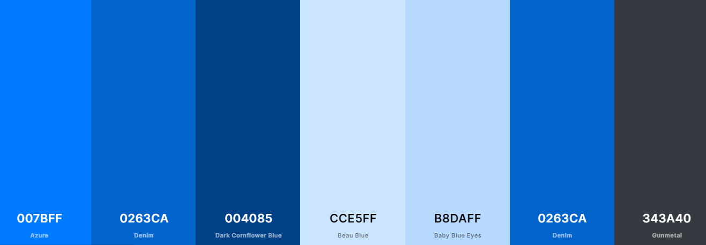
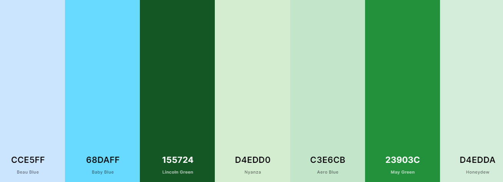
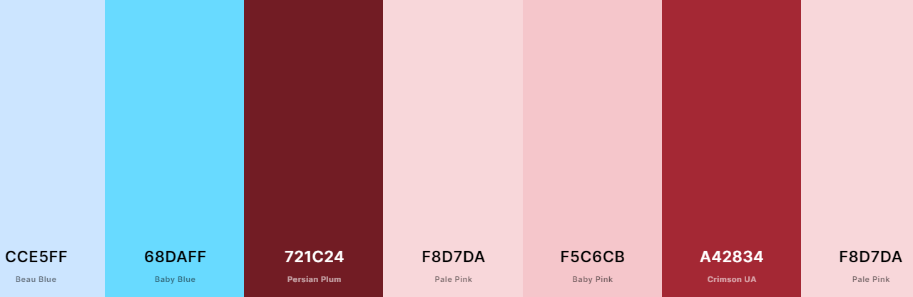
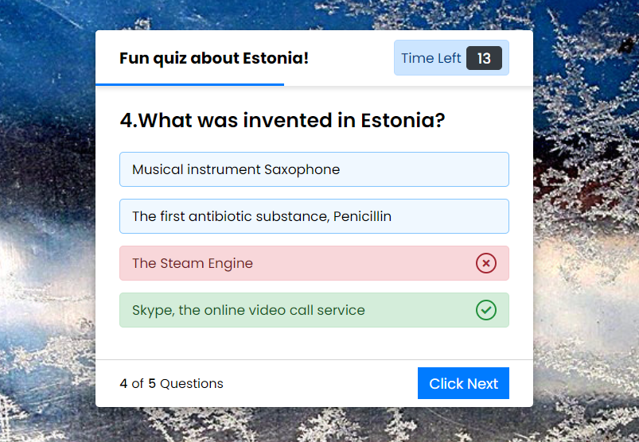
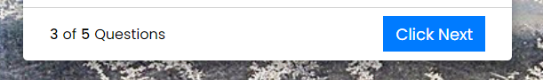
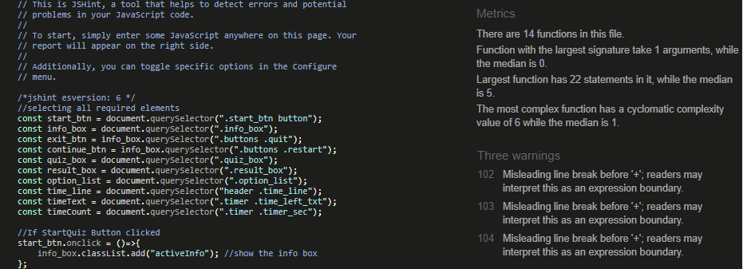

# QUIZ  GAME  about  ESTONIA

## Welcome to my very first game!

This website was built as part of the learning material for Code Institute's Fullstack Web Developer program (5P) Portfolio Project Two. It will be a quiz website aimed at the people who would be interested in Estonia or people, who never even heard about Estonia and are interested in a short game.

You can check out the website [here!](https://helej.github.io/quiz-game-about-Estonia)

## Project Description
This site was created  to get more familiar with common development tools like Gitpod, Git & GitHub, and how to use them to write and manage code. The website content will be created with HTML, the website will be styled with the use of CSS, and its functionality will come from the implementation of JavaScript.The project itself will display a breakdown of the different technologies used in each of the different sections of the program.

## Technology
* HTML5 - Programming language for structuring the site.
* CSS3- Style sheet programming language.
* JavaScript - Scripting language that enables to create dynamically updating contect.
* [Font Awesome](https://fontawesome.com/) -used to provide icon to the result-box.
* [Google fonts](https://fonts.google.com/) -used to select and provide typography.
* [Github](https://github.com)- software hosting platform to keep project in a remote location
* [Gitpod](https://gitpod.io/workspaces) - a development hosting platform
* Git - used for version-control.
* Chrome Dev Tools - used to view responsiveness and layout as site was being developed. I found this very useful when developing the site, as it aided my learning throughout the project.
* Validators:
1. [jshint](https://jshint.com)
2. [validator.w3.org](https://validator.w3.org)
3. jigsaw.w3.org/css-validator

# Table of contents
1. Introduction
2. Design  
3. Features
4. Future Features
5. Testing
6. Deployment
7. Credits

##  Introduction

As an Estonian living abroad already for many years, I'm used to seeing confused faces when I'm telling I'm Estonian.  Most people don't have the slightest clue where Estonia can even be? Is that a small country even in Europe? 
For my second project, I thought I will be an ambassador. I created a short quiz game about a small country, far far away. Country what is bigger than Denmark or Switzerland but population only 1,3 million and decreasing.

* After entering a game and reading rules you can start a game.

* There is a total of 5 five questions and 4 four options answers. After you selected an option, if this option is correct then there appears a green tick icon, and if wrong then you see a red cross. By selecting the wrong answer, you will be shown the right answer. 

* In the end, is a result box with a score and replay & quit button.

* The quiz is created to inspire, and add curiosity about Estonia.

# UX

## External User goals

As a prospective user, I want to

* View questions and answers about Estonia to get more interest.
* Be able to see running time.
* Be able to see running timeline - visual running time.
* Be able to see right answer even I selected wrong ansver.
* Be able to see my score for the game.
* Be able to view the site on mobile/desktop/tablet.
* Be able to access all pages and navigate without confusion, without too many clicks.
* Submit questions.

## Site Owner goals

As site owner I want

* To provide a fun, interactive site that is easy to navigate, and can be viewed on different screen sizes.
* The user to enjoy playing the game.
* Give some interesting facts and information about Estonia and estonians.

### Colour scheme

* My color scheme is inspired by the Estonian flag: Blue , black  and white .

Blue expresses faith and hope for the future of the Estonian people. A symbol of loyalty.

Black is reminiscent of the gloomy and torturous past of the Estonian people, the black soil of their homeland. A symbol of love.

White symbolizes the Estonian people's aspirations for education and spiritual light. Winter white snow, summer white nights, white birch bark of Estonian birches.

To create colour palette I used [Coolors](https://coolors.co)

Blue colour palette:

 Quiz box option list  with right answer colours:
 

 Quiz box option list with wrong answer colours:
 
 
## Features

* In this quiz game, there are three layers or boxes. Those boxes are shown one by one on a particular button clicked.

* Start page consists of a background image and button labeled "Start Quiz".

* The background image is inspired by the Estonian flag. ( A picture says more than a thousand words.) 

* After selecting "Start Quiz" button, the info box appears with popup animation.

* Infobox page consists of Title, List of rules, and two buttons "Exit Quiz" and "Continue".

* When you clicked on the " Exit Quiz" button, the Info box will be hidden.

* When you clicked on the "Continue" button, then the Quiz box appears

* Quiz boxs page header consists Title (on the left side), and Timer box (on the right side).

* This timer starts decrement from 20 to 0 sec.

* There is also shown a timeline indicator that is sliding from left to right according to the timer.

* If the player selects an option between 20 to 0 sec, the timer will be stopped and all available options will be disabled. 

* Quiz box page middle part consists question and selection of answers.

* If the player selected option is correct (right), then selected option color, background color changed to green and there is also shown the tick icon to inform the user that the selected answer is correct.

* If the player doesn't select an option between 20 to 0 sec, the timer will be stopped once it comes in 0 and the correct option of that question will be automatically selected.

* If the player selects an option that is incorrect (wrong), the selected option color, background color changed to red and there is shown the cross icon to inform the user that the selected option is incorrect.

* The correct option will be automatically selected and shown.

* Left side is question counter and right side is "Next clic" button to show you next question.

* There is a total of five questions on this Quiz.

* The Result box consists of an icon - a trophy, text to show player score in the middle, and buttons for "Replay" or "Quit" options.

* When a player clicks on the "Replay" button, the quiz will start again with the number 1 question, and the score of the player will be 0.

* When a player clicks on the "Quit" button, the current window will be reloaded and the quiz starts from the beginning.

## Future Features

* My main goal is to open a window for a player who never heard about Estonia, so for that reason, I would remove the timer.

* On other hand, some players like an adrenalin rush, so for that reason was good to give an option "with timer" or "without timer".

* I would like to add background sound effects - as Estonia is covered 50% with forest, so the birds chirping in the forest would be suitable.

* Difficulty levels for questions.

* More questions to be added to array.

* Shuffle the answers provided within the question. eg same answer doesn't always appear at position A.

* After the Result box, I would make an "Want to know more" box for links for those players who would like to get more information about subjects that came up in questions. 

# Testing

1. Manual testing

* Checking responsiveness

I confirmed that this project is responsive, looks good on functions on all standard screen sizes using the devtools device toolbar.

* Browser Validation

I tested that this page works in different browsers: Chrome and Internet Explorer

2. Automated testing
* Code validation
* Lighthouse auditing

## Validator 

* [html validator](https://validator.w3.org/nu/?doc=https%3A%2F%2Fhelej.github.io%2Fquiz-game-about-Estonia%2F) No errors

 No errors

* [css validator](https://jigsaw.w3.org/css-validator/validator?uri=https%3A%2F%2Fhelej.github.io%2Fquiz-game-about-Estonia&profile=css3svg&usermedium=all&warning=1&vextwarning=&lang=en)

* [jshint validator](https://jshint.com/)

# Issues and Bugs

* Was getting warnings in jshint in relation to ES6. Resolution found to clear these.
* jsHint /jshint esversion:6/ added to top of js file, removed warnings.

* Timer and time liner didnt run sync. Corrected SetInterval. (JavaScript in easy steps by Mike McGrath)

* Timer didnt start accounting from 20 decreasing stright away, showed at first previus answer time result.
* Added timeCount.textContent = time to function startTimer. Solved this issue.

* My biggest issue is still grammar mistakes. Need to pay more attention. 
* [Grammarly](https://grammarly.com) is great help.
 

# Deploiment 

The site was deployed to GitHub pages. The steps to deploy are as follows:

1. Log into [GitHub](https://github.com) or [create an account](https://github.com).
2. Locate the [Github Repository](https://github.com/HeleJ/quiz-game-about-Estonia). 
3. At the top of the repository, select Settings from the menue items.
4. Scroll down the Settings page to the "GitHub Pages" section.
5. Under "Source" click the drop-down menu labelled "None" and select "Master Branch".
6. Upon selection, the page will  automatically refresh meaning that the website is deployed.
7. Scroll back down to the "GitHub Pages" section to retrieve the deployed link.
8. At the time of submitting this Milestone project the Development Branch and Master Branch are indentical.

The live link can be found here - [Quiz about Estonia](https://helej.github.io/quiz-game-about-Estonia)

# Forking the Repository

By forking the GitHub Repository we make a copy of the original repository on our GitHub account to view and/or make changes wiwwthout affecting the original repository by using the following steps:

1. Log into [GitHub](https://github.com) or [create an account](https://github.com).
2. Locate the [Github Repository](https://github.com/HeleJ/quiz-game-about-Estonia). 
3. At the top of the repository, on the right side of the page, select "Fork".
4. You should now have a copy of the original repository in your GitHub account.

# Credits

* [Code Institute Tutor Support](https://learn.codeinstitute.net/ci_support/diplomainsoftwaredevelopmentecommerce/tutor). 

* I would like to thank this time my two mentors Tim and Seun for their unwavering encouragement and guidance throughout.

* I would like to thank pediatrician dr. Ann-Marie Murphy from Limerick Regional Hospital, who helped my son after a long illness to recovery road. My first project was delayed, and the time to spend on JavaScript studying was rushed because of unseen circumstances. I spent more time in the ambulance and hospital without any hope. Dr.Murphy gave back life quality to my son, and me a chance to study again in this hard but wonderful course.

## Content

### Code

* The code to make my second project was taken from Youtube 
* I part:["Create a Quiz App with Timer using HTML CSS & JavaScript"](https://www.youtube.com/watch?v=pQr4O1OITJo&t=1324s) 
* II part from [here](https://www.youtube.com/watch?v=WUBhpSRS_fk&t=5s)

The first video instructing how to build up content using HTML and CSS, and the video was a JavaScript tutorial. Codes from both videos have been edited to fit the needs of the Quiz about the Estonia website. I wish I could have written all of the JavaScript code independently, however, I felt that using some pre-made code that already did (almost) what I needed it to, would improve the standard of code, decrease the chance of potential bugs and allow me to work within the timeframe to meet the deadline for the project. I was able to edit and add things to the code as and when I needed to be able to make the web-quiz interactivity how I had imagined it during the planning phase.

The following sites were used on a more regular basis:
* [Stack Overflow](https://stackoverflow.com) 

* [W3Schools](https://www.w3school.com)

### Questions and answers in the web quiz were found and worded by myself

* Material for question 2 [Kiiking](https://kiikest.ee/eng/kiiking/)

* Material for question 3 [Skype](https://content.dsp.co.uk/history-of-skype)

* Material for question 5 [E-residency](https://e-resident.gov.ee/)

## Media

* The background image used throughout the website, and used for different screen sizes  was taken from [here](https://pildiait.erm.ee/lipuvarvid-varahommikul/)

This site was developed for Educational purposes